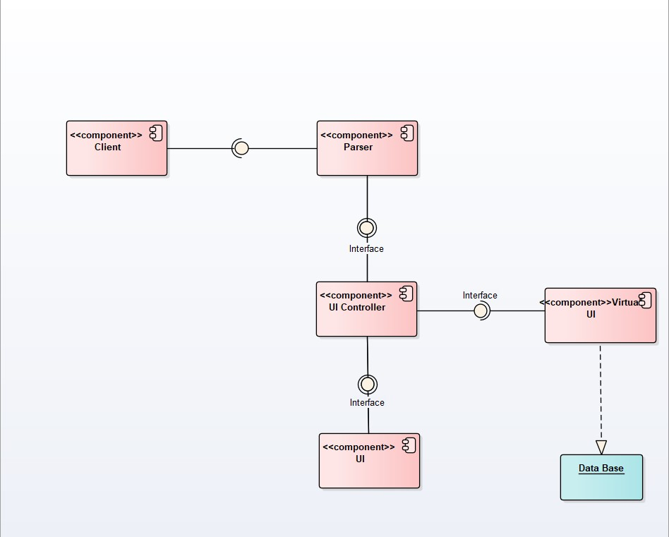

# Tim4
Projektni zadatak Virtual UI

Potrebno je napraviti dizajn sistema, arhiteksturu sistema, implementirati i istestirati rešenje koje simulira rad sledećeg sistema.

 
Sistem sadrži sledeće komponente:
⦁	Client-odnosno korisnik koji bira jednu od dve ponudjene opcije.Prva opcija je da unese tekst u odgovarajućem html formatu, a druga opcija je da unese putanju do fajla
⦁	Parser-zadatak parser komponente jeste da proveri da li je sve uneto kako treba i u odgovarajućem html formatu.Ukoliko je korisnik uneo tekst u ispravnom html formatu parser taj tekst upisuje u fajl.Ukoliko postoji neki problem parser vraća korisniku poruku o grešci, ukoliko nema problema onda parser informacije o fajlu prosledjuje UI Controller komponenti
⦁	UI Controller-prosledjuje dobijeni fajl od parsera Virtual UI komponenti, a zatim kada dobije promenu od Virtual UI komponente menja samo odgovarajući deo fajla koja se prikazuje na UI komponenti
⦁	Virtual UI-prvo proverava da li fajl koji je korisnik uneo već postoji u bazi podataka, a zatim ako postoji uporedjuje njihove sadržaje, ukoliko ima promena u sadržaju on te promene prosledjuje UI Controller komponenti
⦁	UI-na osnovu dobijenih promena osvežava samo izmenjeni deo prikaza
⦁	DB-Baza podataka(DataBase) sastoji se iz tri tabele.Prva tabela je tabela Fajl koja sadrži id fajla, naziv fajla i ekstenziju.Druga tabela je tabela Sadržaj fajla id fajla, id sadržaja i sam sadržaj.Treća tabela je tabela Delta koja sadrži id fajla, opseg linija na kojima ima promena i sadržaj promene

Scenario rada aplikacije
Aplikacija se sastoji od jedne konzolne aplikacije (UnosTeksta) koja u sebi sadrži bazu podataka, klasu program.cs u kojoj se pozivaju sve potrebne metode i klase UnesiteTekst u kojoj se korisniku omogućava da bira jednu od dve opcije(unos teksta u html formatu, unos putanje fajla). Sadrži i još pet Class Library-ja (Common, Parser, ParserFile, UI Controler i virtualui), kao i dva foldera u kojima su radjeni testovi (ParserTest, Virtual UI controler Test).
Kada se pokrene aplikacija, korisnik prvo bira jednu od dve ponudjene opcije. Prva opcija je da se korisniku omogući unos teksta u html formatu, a druga opcija je da se omogući korisniku da unese putanju do fajla. Ako korisnik izabere prvu opciju, nakon toga se korisniku prikazuje poruka od parsera da li je tekst unet u ispravnom html formatu. Ukoliko je korisnik uneo tekst u ispravnom html formatu taj tekst se upisuje u fajl pod nazivom koji je korisnik sam odabrao, a zatim se podaci kao što su naziv fajla upisuje u bazu podataka pod nazivom Fajl kao i ekstenzija fajla, dok se sadržaj fajla upisuje u bazu podataka SadržajFajla. Ako korisnik želi da vidi koje sve podatke ima upisano u bazu podataka mora da prati sledeća uputstva:
⦁	Levi klik na Baza.mdf
⦁	Desni klik na Server Explorer
⦁	Proširiti Data Connections 
⦁	Desni klik na Baza.mdf
⦁	Odabrati opciju Modify Connection
⦁	Uneti bin\Debug nakon UnosTeksta\
⦁	Kliknuti OK
⦁	Osvežiti bazu klikom na kružnu strelicu
⦁	Proširiti Baza.mdf
⦁	Proširiti folder Tables
⦁	Odabrati željenu tabelu i dvoklik na nju da bi se video njen sadržaj
Nastavak rada programa.
Zatim se informacije o fajlu prosledjuju UI Controller komponenti koja te podatke prosledjuje Virtual UI komponenti. Nakon toga stiže odgovor od Virtual UI komponente da li fajl sa tim nazivom već postoji u bazi podataka, ako postoji onda se taj fajl ne upisuje u bazu podatak, u suprotnom se upisuje naziv fajla i ekstenzija u bazu podataka Fajl, a u bazu podataka SadržajFajla se upisuje sadržaj fajla. Ukoliko postoji takav fajl u bazi podataka onda se uzima sadržaj iz baze podataka SadržajFajla i poredi se sa unetim tekstom. Ukoliko su isti sadržaji fajlova, ispisuje se poruka da su sadržaji isti, odnosno da nema promena u sadržaju. Ukoliko sadržaji fajlova nisu isti ispisuje se sama promena(zelenom bojom) kao i broj promena koji je nastao kao i ceo tekst sa samom promenom(zelenom bojom).
Ukoliko korisnik odabere drugu opciju, korisniku će se ponuditi da unese putanju do fajla. Korisnik mora uneti putanju koja vodi do bin\Debug unutar projekta, jer se tamo nalaze svi fajlovi koji su kreirani i uspešno upisani u bazu podataka.Ukoliko je korisnik uneo naziv fajla koji već postoji u folderu bin\Debug, korisniku se ispisuje poruka da takav fajl već postoji u bazi podataka I da nije upisan u bazu podataka, a zatim se ispisuju podaci o fajlu kao što su naziv fajla i putanja do tog fajla. Ako korisnik unese putanju do fajla zajedno sa nazivom fajla koji ne postoji u bazi podataka, korisniku se ispisuje poruka da takav fajl ne postoji, i fajl sa tim nazivom se upisuje u bazu podataka.
Projekat radili:
Jovan Čonti PR69-2017
Milenko Pjaca PR67-2017
Tim 4
